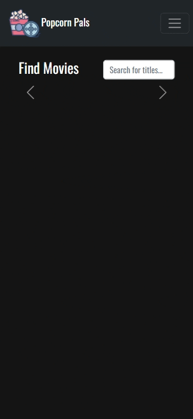

# PopcornPals

## Table of Contents

* [Description](#description)
* [Installation](#installation)
* [Usage](#usage)
* [Contributions](#contributions)
* [Additional Information](#additional-information)

## [Description:](#table-of-contents)

Tired of the same movies being suggested to you on most streaming services? Feel like you can never remember any of the titles that your friends have suggested to you because there is no option to share movies on those same services with other users? Well, now there's an option! *PopcornPals* is not a streaming service, but instead a social media type service that allows you and your friends to suggest and rate movies together. Add friends and suggest titles to them personally, and find all your suggested titles in one neat place. Rate and review titles, and see what other *PopcornPals* members think.

```
As a movie lover
I want to be able to suggest titles to my friends
and see what they think about them.
```

## [Installation:](#table-of-contents)

To use *PopcornPals*, all you need to do is visit the live site [here on Heroku](https://popcornpals.herokuapp.com/). To access all features, sign up for an account.

To work with this project's code base, ensure that you have Node.js and MongoDB pre-installed on your machine.

1. Clone this repository onto your machine with `git clone`
2. Install dependencies from each directory (*root / server / client*) with `npm install`
3. Initialize server connection, from the *server* directory run `npm start` or `npm run watch` to use nodemon. This project also uses the **concurrently** npm package. From the *root* directory you can achieve the same result with `npm run develop`
4. Visit `localhost:3001/graphql` to connect to Apollo Studio to test queries and mutations
5. Initialize the React development environment from the *client* directory run `npm start`. If not automatically redirected after compiling, navigate to `localhost:3000` in your browser.

## [Usage:](#table-of-contents)

Search for titles using the search bar. Clicking on the poster will take you to the title's detail page which includes all ratings from fellow *PopcornPals* members. In order to rate or suggest titles to others, sign-up for an account. You can access a full list of suggested and rated titles from your profile page!




## [Contributions:](#table-of-contents)
Contributions always welcome!

## [Additional Information:](#table-of-contents)
Technologies Used:
* MongoDB
* Express.js
* React.js
* Node.js
* Mongoose
* Apollo 
* GraphQL
* React-Bootstrap / Bootstrap

Other Packages Used:
* [nodemon](https://www.npmjs.com/package/nodemon)

_If you have any questions about the application, or would like to become a contributor, please contact me using the information below:_

[GitHub](https://github.com/blindsweatyhansolo)
